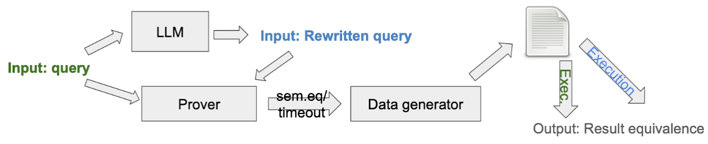

# Verified LLM SQL Query Rewrite: Design Doc
*Last edited: April 9th, 2025*

## Overview

This project optimizes SQL queries by providing a LLM with table schema and statistics, prompting it to generate a new query, and then verifying semantic equivalence using semantic prover and running both queries on generated datasets to check for identical outputs. It explores how LLMs can contribute to database management by learning to optimize queries while maintaining correctness, providing insights into the potential of AI in query optimization.

## Scope
This project is a standalone system that operates independently of existing components, relying solely on the LLM for query generation, a semantic prover for verification, and DuckDB for query execution. It does not modify any parts of the existing DBMSs.

<!-- ## Glossary (Optional)

>If you are introducing new concepts or giving unintuitive names to components, write them down here. -->

## Architectural Design

1. Give LLM background information about the table (schema and statistics)
2. Feed the original query to the LLM & ask LLM to generate new optimized query
3. Feed original query and LLM-optimized query into semantic prover (QED) to check of semantic equivalence
4. If semantically equivalent, generate synthetic datasets to run the original query and LLM-optimized query on & check for identical outputs

### Component breakdown
LLM Prompting Engine
- Purpose: Constructs a prompt using the original query, schema, and statistics
- Output: An optimized SQL query from the LLM

Semantic Prover
- Purpose: Uses static analysis to determine if the original and optimized queries are semantically equivalent
- Output: Boolean result (equivalent or not)

Synthetic Data Generator
- Purpose: Generates synthetic datasets based on the input schema.
- Output: Synthetic tables used for runtime validation

Query Executor (DuckDB)
- Purpose: Executes both original and generated queries on the synthetic data.
- Output: Result sets for comparison

Result Comparator
- Purpose: Compares the result sets of both queries for exact match
- Output: Boolean result (equivalent or not)

## Design Rationale

The main goals of this design are to ensure the correctness, efficiency, and reliability of LLM-optimized queries by not just validating their semantic equivalence to the original queries, but also verifying that they produce identical results on synthetic data. This dual-layer validation helps catch both discrepancies and differences that may not be evident through static analysis alone. 

A potential alternative would be to just use the existing QED to verify the LLM-optimized query. However, after we played with the tool, we realized that something as small as adding a predicate clause could cause the QED to output false positives. Hence, something more is needed to check for query equivalence.

Another alternative we considered is to manually review the query plans before and after to check if the two queries are equivalent. We decided against doing this because after trying this out on a few queries, we found that the LLM-optimized queries never have the same plan, making it very difficult to determine the equivalence or extent of optimization based on that.

## Testing Plan
Each data point in our evaluation will consist of an original SQL query and its corresponding LLM-rewritten version. The true label is determined by executing both queries on the original workload and comparing their results. The predicted label is generated by inputting the two queries into our verifier pipeline to check if they pass semantic analysis, work on randomly generated data, and handle edge cases correctly. Performance will be measured in terms of correctness, tracking false positives and false negatives by comparing actual execution outputs. Additionally, we will monitor improvements in execution time to evaluate optimization effectiveness. We are using TPC-DS and DSB as our main benchmarks to evaluate our pipeline on.

## Trade-offs and Potential Problems
One key decision that was made was to use synthetic data instead of real-world data for validating LLM-optimized queries. This may fail to capture the full complexity of production data, potentially allowing incorrect queries to pass validation. More information on this is described in the future work section.

Another trade-off was assuming that matching outputs on synthetic datasets implies true semantic equivalence. This can be problematic for edge cases involving complex joins, aggregations, or NULL semantics, where queries may produce identical outputs in limited test scenarios but diverge in real-world behavior. This is definitely a risk with the way we have designed this system and we may brainstorm some methods to minimize the risks of this happening.

Another decision that we made is to use DuckDB as the DBMS to execute the queries due to its lightweight footprint and efficient optimizer. However, this choice may introduce compatibility issues when validating queries intended for other systems like PostgreSQL, especially for syntax variations or engine-specific behaviors.

## Future Work
Right now, if a query takes too long to execute in DuckDB (without optimizer) through the DuckDB Python API, we don’t have a clean way of stopping it because DuckDB does not have a built-in timeout system, nor can Python stop any promises that have started executing. This is definitely a problem that we want to address. 

One improvement is expanding the validation framework to support anonymized or sampled real-world data will help capture edge cases and validate queries under more realistic conditions. SlabCity is the first synthesis-based query rewriting technique that allows whole query optimization without relying on rewrite rules, and one of its components is an equivalence checker. While developing this checker, they found that it is better to extract hints from queries using a syntactic analysis to guide the input generation process instead of randomly generating data to test query equivalence. This ensures that the generated inputs are more likely to trigger scenarios where common errors happen and other edge cases. The examples given in the paper include looking at filters that produce non empty outputs, duplicate non key values, and duplicating GROUP BY columns. This might be something we want to incorporate into our own data generation pipeline as synthetic data is unlikely going to catch all the edge cases that could cause the two queries to be not equivalent. 

Another improvement would be to test out different LLMs to compare optimization performance. Right now we are using GPT-4o, but it would be interesting to see how other LLMs’ performance compare.

## Resources
- [QED](https://github.com/qed-solver)
- [SlabCity: Whole-Query Optimization using Program Synthesis](https://dl.acm.org/doi/pdf/10.14778/3611479.3611515) (Thanks Sam for bringing this up!)